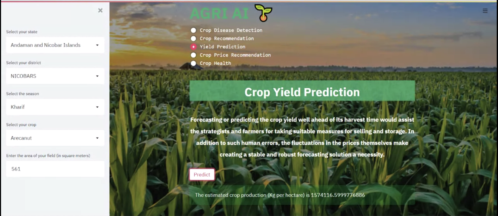
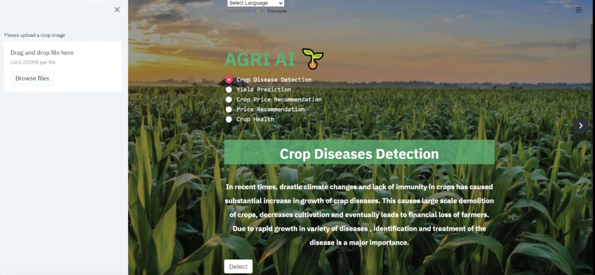
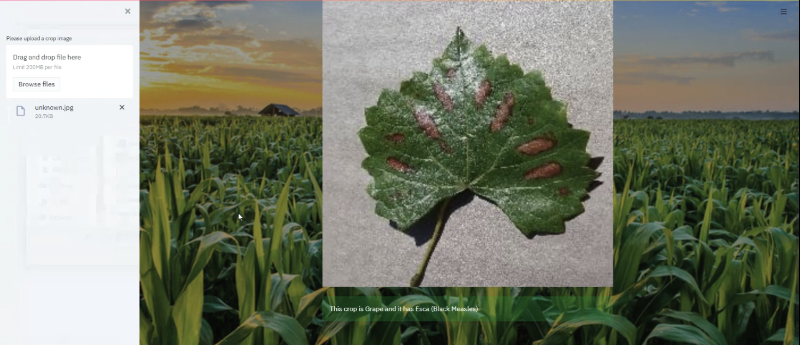
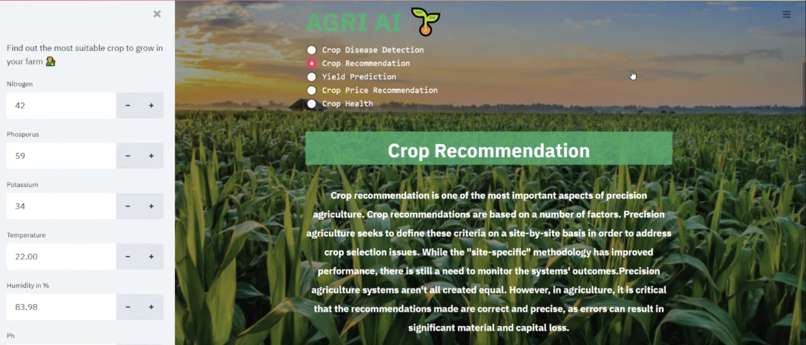
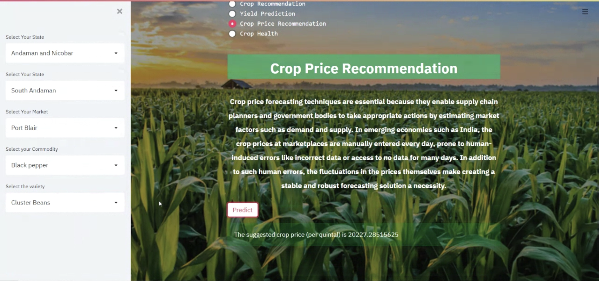
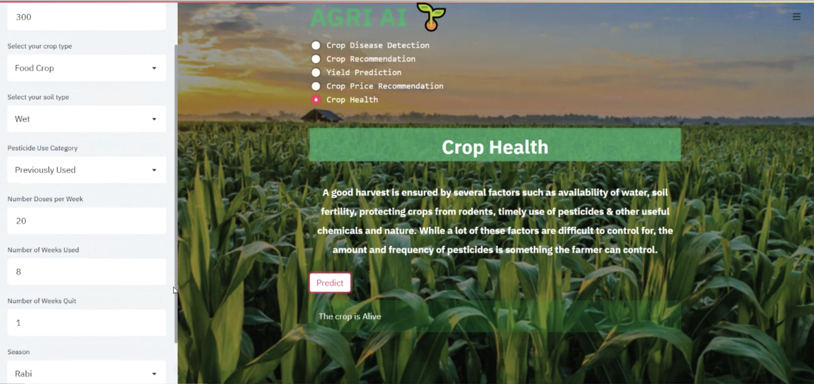

# AgriAI
An end-to-end web application developed to assist farmers in administering their crop quality, control and foresee selling price. 

The actions provided by the webapp are:
1. Crop Yield Prediction:Predicting the net crop yield for a given input recieved from the farmers.

2. Crop and disease Detection:Checking whether the grown crop is infected or healthy by taking image as an input through AI image processing techniques.

3. Crop Recomendation: Addressing crop selection issues by suggesting a crop to cultivate by monitoring site-specific features of the farmer's field.

4. Crop Price Recommendation: Propose a price that the farmer should market the produce at to maximize earnings using an AI model. 

5. Crop Health:Determining the outcome of the harvest season, i.e. whether the crop is healthy (alive), or has been damaged by pesticides or by any other reason.
 

